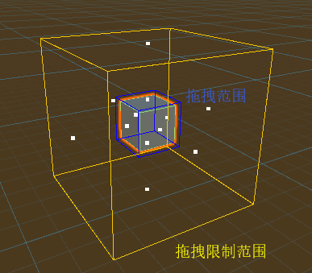

# DragableForm

### Description

空间中可拖拽的形体组件，该组件的拖拽实现的算法不依赖UnityEngine原生的事件系统 ，但是空间检测的算法采用的是Unity的Bounds，而在CatEngine模式下的Bounds是没有类似于原生碰撞机Matrix4x4的矩阵变换的，所以在处理业务中的模型的旋转、缩放操作时CatEngine也提供了原生的碰撞机的Bounds进行支持。

下面的一些模式选择就是对应上文所描述的：

| BoundaryMode | Description |
| :--- | :--- |
| CatEngine | 使用CatEngine的Bounds作为拖拽范围的计算载体。 |
| Native | 使用UnityEngine的Bounds作为拖拽范围的计算载体。 |

| BoundaryMode | Description |
| :--- | :--- |
| None | 不使用拖拽限制范围。 |
| Fixed | 拖拽限制范围固定在设置的点。 |
| FollowTarget | 拖拽限制范围跟随目标中心点。 |

### Properties

| Name | Virtual | Description |
| :--- | :--- | :--- |
| Dragging | 否 | 是否正在拖拽。 |
| DragDirectionInScreen | 否 | 在屏幕坐标的拖拽方向。 |
| DragDirectionInWord | 否 | 在世界坐标的拖拽方向。 |
| CanDrag | 否 | 设置是否可以进行拖拽。 |
| BoundaryMode | 否 | 拖拽边界的模式。 |
| DragLimitMode | 否 | 拖拽限制范围的模式。 |
| MouseButton | 否 | 设置产生拖拽的鼠标按键。 |
| LockX | 否 | 拖拽时候锁住X轴。 |
| LockY | 否 | 拖拽时候锁住Y轴。 |
| LockZ | 否 | 拖拽时候锁住Z轴。 |
| ExcludeRigidBody | 否 | 是否排除刚体的影响。 |
| IgnoreChildrenNativeBoundaries | 否 | 采用原生碰撞机bounds进行模拟拖拽边界时，是否忽略孩子的原生碰撞机。 |
| Rigidbody | 否 | 刚体的引用。 |
| Origin | 否 | 拖拽范围的中心点。 |
| Boundary | 否 | 拖拽范围边界的bounds。 |
| DragLimit | 否 | 拖拽限制范围边界的bounds。 |
| DragLimitFollowTarget | 否 | 设置拖拽范围的bounds是否跟随目标的Transform。 |
| NativeBoundaries | 否 | 原生的碰撞机边界的集合。 |
| DrawGimozs | 否 | 是否进行Gimozs绘制。 |
| DrawCoordinateSystem | 否 | 是否进行Gimozs绘制拖拽范围的坐标轴。 |
| GizmosSphereRadius | 否 | 进行Gimozs绘制坐标轴的端点球体半径大小。 |

### Methods

| Name | Virtual | Description |
| :--- | :--- | :--- |
| ResetDragLimitCenterToSelf | 否 | 重置拖拽限制bounds的中心点到自身中心点。 |
| ResetDragLimitCenterToFollowTarget | 否 | 重置拖拽限制bounds的中心点到跟随目标的中心点。 |
| IntersectRay | 是 | 是否与射线相交。 |

###  

